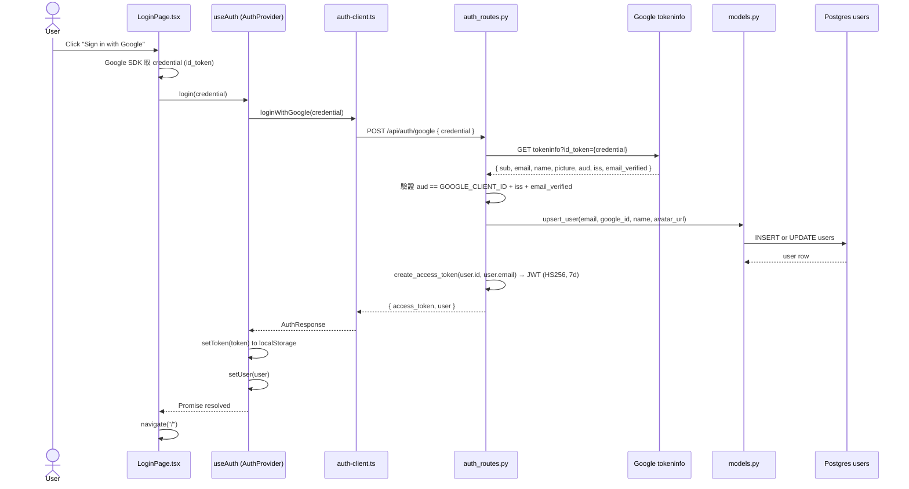
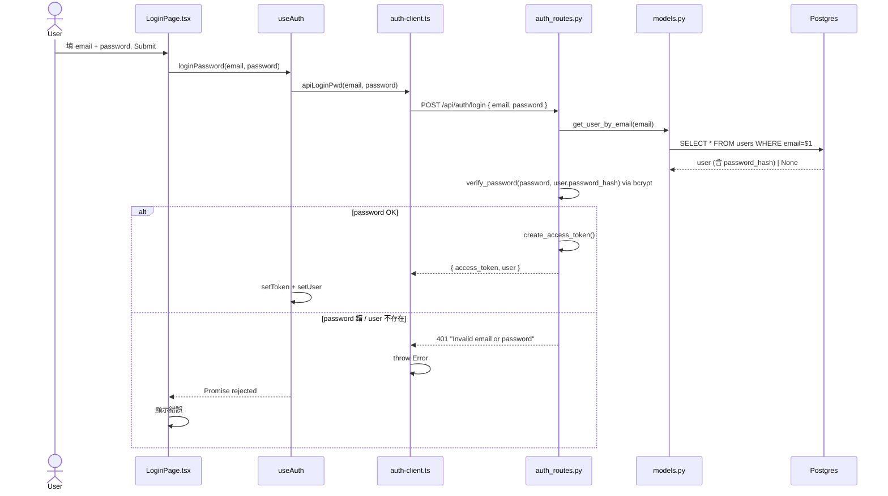
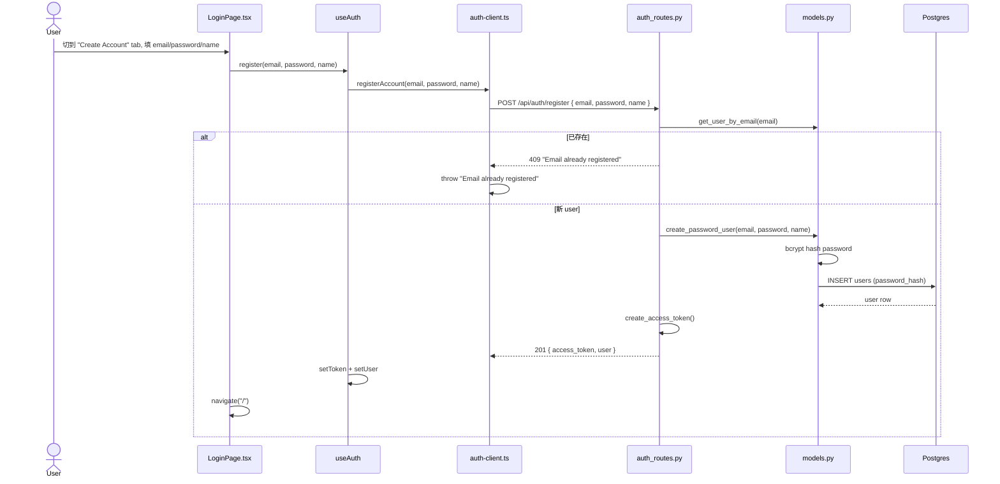
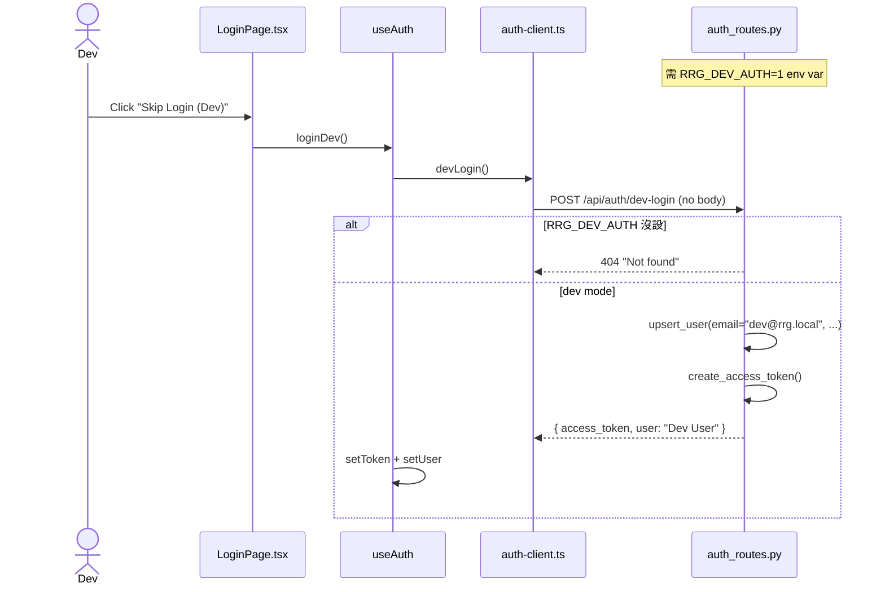
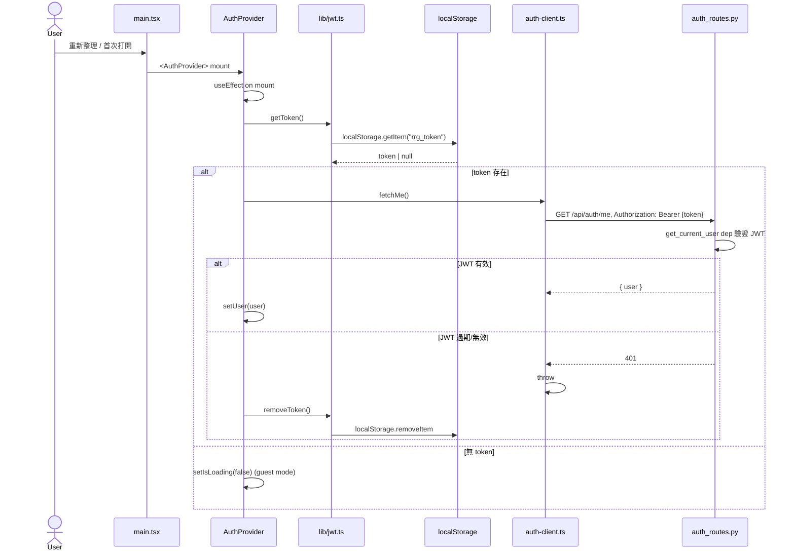

# Sequence 01 — Login Flow

> **Type**: Sequence diagram (L3, 子目錄重置編號)
> **Layer**: lockstep（跟 code 同步）
> **Last verified**: 2026-05-24 against `feat/viewport-am-fix`

## User Story

未登入 user 打開 RRG → 看到 LoginPage（3 個按鈕：Google / Email / Dev Skip）→ 選一個登入 → JWT 寫 localStorage → 跳轉 `/`（主畫面）→ 重新整理頁面，token 還在 → 自動帶 token 驗證 → 不用再登入。

涵蓋 **5 個 entry**：
1. **Google OAuth**（標準 user）
2. **Email + Password login**（已註冊 user）
3. **Email + Password register**（首次註冊）
4. **Dev bypass**（dev 環境跳過驗證）
5. **Auto-verify on mount**（reload 後恢復 session）

---

## Sequence Diagrams

### 5.1 Google OAuth Login



### 5.2 Email + Password Login



### 5.3 Self-service Register



### 5.4 Dev Bypass



### 5.5 Auto-verify on Mount (reload after login)



---

## 涉及檔案

### Frontend

| 檔案 | 行 | 角色 |
|------|-----|------|
| [main.tsx](../../../frontend/src/main.tsx#L17-L42) | 17-42 | `<AuthProvider>` 包在 5 層 Provider stack 第 3 層 |
| [pages/LoginPage.tsx](../../../frontend/src/pages/LoginPage.tsx) | (143) | 3 個 button + form，呼叫 useAuth 對應 method |
| [hooks/useAuth.ts](../../../frontend/src/hooks/useAuth.ts#L23-L75) | 23-75 | Context state + 5 個 action（login/loginPassword/register/loginDev/logout）+ auto-verify useEffect |
| [api/auth-client.ts](../../../frontend/src/api/auth-client.ts) | (72) | 5 個 fetch wrapper 對應 5 個 endpoint |
| [lib/jwt.ts](../../../frontend/src/lib/jwt.ts) | (?) | getToken / setToken / removeToken (localStorage) |
| [components/AuthGuard.tsx](../../../frontend/src/components/AuthGuard.tsx) | - | 路由保護（unused now, guest mode 已開）|
| [types/auth.ts](../../../frontend/src/types/auth.ts) | - | TS 介面 User / AuthResponse / UserSettings |

### Backend

| 檔案 | 行 | 角色 |
|------|-----|------|
| [server/auth_routes.py](../../../server/auth_routes.py#L36-L125) | 36-125 | 5 個 endpoint（google/login/register/dev-login/me）+ Google token verify helper |
| [server/auth_schemas.py](../../../server/auth_schemas.py) | - | Pydantic schemas: AuthResponse / GoogleAuthRequest / LoginRequest / RegisterRequest / UserProfile |
| [server/auth_deps.py](../../../server/auth_deps.py) | (50) | `get_current_user` FastAPI Depends — Bearer token 解碼 |
| [server/jwt_utils.py](../../../server/jwt_utils.py) | (?) | create_access_token / 驗證（HS256, 7d expiry）|
| [server/models.py](../../../server/models.py) | (152) | upsert_user / create_password_user / get_user_by_email / verify_password (bcrypt) |
| [server/db.py](../../../server/db.py) | (196) | users 表 schema (R-候選: 無 alembic) |

---

## 關鍵概念補底（React / TS / FastAPI）

### React Context Provider Pattern

```typescript
// useAuth.ts L22-22
const AuthContext = createContext<AuthState | null>(null);

// L24-27: hook 是 thin wrapper，throw 防呆
export function useAuth(): AuthState {
  const ctx = useContext(AuthContext);
  if (!ctx) throw new Error("useAuth must be used within AuthProvider");
  return ctx;
}

// L30-75: Provider 是「狀態的擁有者」
export function AuthProvider({ children }) {
  const [user, setUser] = useState<User | null>(null);
  // ... 5 個 useCallback 包的 action
  return createElement(AuthContext.Provider, { value }, children);
}
```

**Unity 比喻**：
- `AuthContext` = `GameManager` singleton 的「插槽」
- `AuthProvider` = 真正的 `GameManager` instance + state
- `useAuth()` = `GameManager.Instance` 取得，但**保證在子樹內**（throw if outside）

### useEffect Auto-verify

```typescript
// L34-39: 只跑一次（deps = []，等同 Unity Start()）
useEffect(() => {
  const token = getToken();
  if (!token) { setIsLoading(false); return; }
  fetchMe()
    .then(setUser)
    .catch(() => removeToken())     // token 過期 → 清掉
    .finally(() => setIsLoading(false));
}, []);  // ← 空陣列 = mount-only
```

**Unity 比喻**：等同 `Start()` 跑一次，內部 await 完成才繼續。

### Discriminated Union（TS pattern 沒用到，但常見）

`AuthState` 是 plain interface，沒用 discriminated union。**未來**可改進：
```typescript
type AuthState =
  | { status: 'loading' }
  | { status: 'guest' }
  | { status: 'authenticated', user: User };
// 強制每個 branch 處理，避免 `isLoading && !user` 等 ad-hoc 組合
```

### FastAPI Dependency Injection

```python
# auth_deps.py 內 get_current_user 是 FastAPI 的 Depends
@auth_router.get("/me", response_model=UserProfile)
async def get_me(user: User = Depends(get_current_user)):  # ← inject
    return UserProfile(**user.to_dict())
```

FastAPI 自動：(1) 從 header 取 Bearer token → (2) 解 JWT → (3) DB 查 user → (4) inject into handler。如果失敗 → 自動 401，handler 不會跑。

---

## 邊界 / 已知議題（送入 [31-refactor-backlog.md](../31-refactor-backlog.md)）

### 環境配置不一致（候選 R20）
[auth-client.ts:6](../../../frontend/src/api/auth-client.ts#L6) 預設 `BASE = "http://localhost:8000"`，但 dev tmux backend 跑在 **`:8666`**。

```typescript
const BASE = import.meta.env.VITE_API_URL ?? "http://localhost:8000";
```

如果 dev 環境沒設 `VITE_API_URL`，frontend 會打 `:8000`（docker / Makefile port），而不是 tmux dev 的 `:8666`。

**修法**：把 default 改 `:8666` 或在 `frontend/.env.development` 明確設 `VITE_API_URL=http://localhost:8666`。

### `authHeaders` 在 auth-client.ts 重複實作（對應 [R11](../31-refactor-backlog.md#r11-)）
[auth-client.ts:8-11](../../../frontend/src/api/auth-client.ts#L8-L11) 自己定義 `authHeaders()`，跟 [tag-client.ts / note-client.ts / basket-client.ts](../../../frontend/src/api/) 重複。應該抽到 `api/client.ts` 統一。

### Google token 自己造輪子（候選 R21）
[auth_routes.py:97-124](../../../server/auth_routes.py#L97-L125) 用 `urllib` 打 Google tokeninfo endpoint 而非 `google-auth` 標準庫。**問題**：
- 沒 cert pinning
- 沒 retry
- 沒 cache（每次 login 都 round trip Google）

**修法**：用 `google-auth` library，內建 cache + 安全驗證。

### Dev token fallback 不安全（候選 R22）
[auth_routes.py:99](../../../server/auth_routes.py#L99) — `if _DEV_MODE and credential == "dev-token"`，任何人在 dev mode 發 `"dev-token"` 字串就能登入任何身份。**production 必須確保 `RRG_DEV_AUTH=0`**（或不設）。

CLAUDE.md / R6 (IBKR architecture constraint doc) 該明確寫「production 部署 must `RRG_DEV_AUTH` unset」。

### 無 refresh token mechanism（候選 R23）
JWT expire = 7 天，到期 user 被踢出要 re-login。沒 refresh token = 沒辦法「靜默續期」。**MVP1 acceptable**（7 天夠長）但長期該補。

### 無 email_login rate limit（候選 R24）
[auth_routes.py:70-77](../../../server/auth_routes.py#L70-L77) 沒 rate limit → 暴力破解可能。生產環境必須加（fastapi-limiter / slowapi）。

### bcrypt cost factor 未驗證（候選 R25）
[models.py](../../../server/models.py) 內 bcrypt hash 但沒指定 cost factor。預設 12 可能太低（2026 標準 14+）。要驗證。

---

## 修法優先序（送 Session 6 排序）

| 議題 | 候選 R | Tier | 緊急度 |
|------|-------|------|--------|
| BASE default port 不一致 | R20 | P1 | 馬上會踩到 |
| authHeaders DRY | 已 [R11](../31-refactor-backlog.md#r11-) | P0 | 5 分快勝 |
| Google token 標準庫 | R21 | P2 | 沒踩過事但該補 |
| Dev token 安全 | R22 | P1 | production 前必確認 |
| Refresh token | R23 | P2 | M2 補 |
| Rate limit | R24 | P1 | production 前必加 |
| bcrypt cost | R25 | P2 | M2 驗證 |

---

## Cross-references

- 上層 entry: [docs/INDEX.md](../../INDEX.md)
- Refactor backlog: [31-refactor-backlog.md](../31-refactor-backlog.md)
- Doc conventions: [00-doc-conventions.md](../../00-doc-conventions.md)
- Architecture entry: [03-implementation.md](../03-implementation.md) (⚠️ 過時)
- 後續 sequence diagrams（待寫）:
  - 02 RRG main data flow
  - 03 Filter + Tag
  - 04 Basket Create + 4 entries
