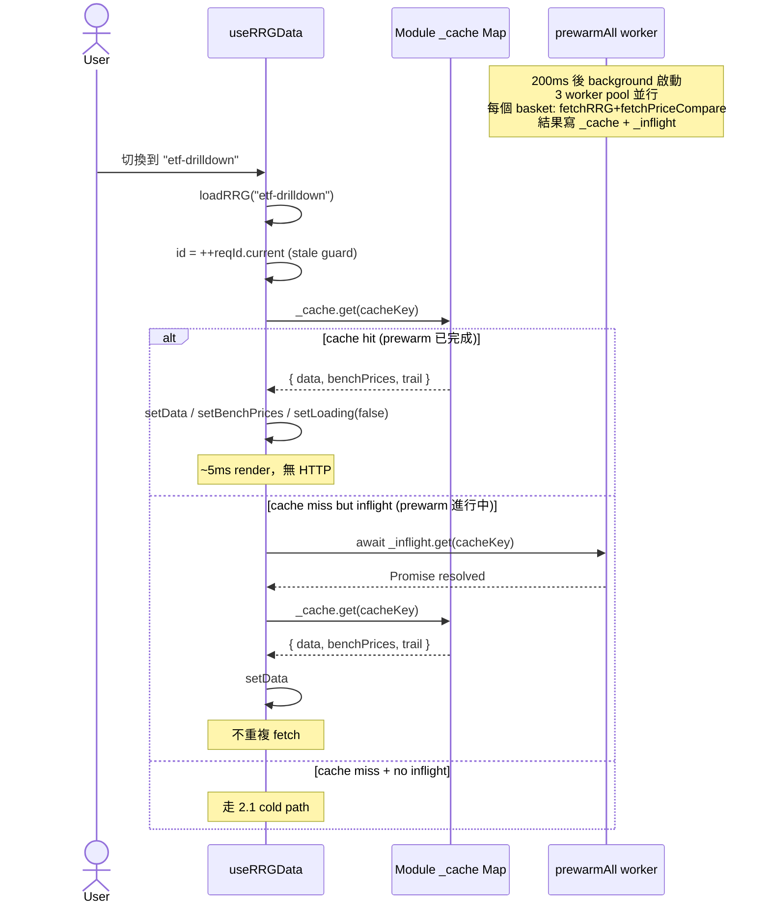
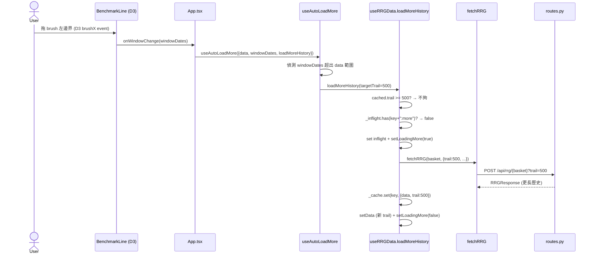

# Sequence 02 — RRG Main Data Flow

> **Type**: Sequence diagram (L3, 子目錄重置編號)
> **Layer**: lockstep
> **Last verified**: 2026-05-24 against `feat/viewport-am-fix`

## User Story

User 打開 RRG (`/`) → App 載入 → 看到「Sectors」籃子的 RRG canvas + benchmark brush + symbol table → 切到「ETF Drilldown」籃子 → **<100ms 切換完成**（背景已 prewarm）→ 拖 brush 看更早歷史 → 觸發 loadMoreHistory 抓更多。

**3 個 entry**：
1. **首次載入**（cold cache → fetch all）
2. **切換 basket**（warm cache → instant render）
3. **拖 brush 過界**（load more history on demand）

涵蓋 backend 3 層 cache（HTTP response cache / OHLCV cache / OHLCV parquet）+ provider fallback。

---

## Sequence Diagrams

### 2.1 首次載入（cold cache full path）

```mermaid
sequenceDiagram
    actor U as User
    participant App as App.tsx
    participant Hook as useRRGData
    participant Client as api/client.ts
    participant Routes as routes.py
    participant SvcCache as services_cache.py
    participant Svc as services.py
    participant Data as data.py
    participant Prov as providers/ibkr.py
    participant YF as providers/yfinance.py
    participant Compute as compute.py
    participant Canvas as RRGCanvas

    U->>App: 打開 /
    App->>Hook: useRRGData({source, timeframe})
    Hook->>Hook: useEffect mount → fetchBaskets()
    Hook->>Client: GET /api/baskets
    Client->>Routes: HTTP
    Routes-->>Client: BasketInfo[]
    Hook->>Hook: setBaskets + (200ms 後) prewarmAll
    Hook->>Hook: useEffect [source/tf] → loadRRG("sectors")
    Hook->>Hook: _cache.get(key) → miss
    Hook->>Client: fetchRRG("sectors", {trail:252})
    Client->>Routes: POST /api/rrg/sectors
    Routes->>SvcCache: cached_compute(key, lambda: build_rrg_response)
    SvcCache->>SvcCache: cache_get(key) → miss (5min TTL)
    SvcCache->>SvcCache: acquire per-key lock (singleflight)
    SvcCache->>Svc: build_rrg_response(basket, ...)
    Svc->>Data: fetch_prices(symbols, period="5y", interval="1d", source="ibkr")
    Data->>Data: _mem_cache check → miss (TTL by interval)
    Data->>Data: load_cache(parquet) → miss (or partial)
    Data->>Prov: provider.is_available() → True
    Prov->>Prov: ib_async.reqHistoricalData
    alt IBKR OK
        Prov-->>Data: DataFrame
    else IBKR 失敗
        Data->>YF: fallback fetch_close
        YF-->>Data: DataFrame
    end
    Data->>Data: save_cache(parquet) + _mem_set
    Data-->>Svc: (prices, meta)
    Svc->>Compute: compute_rrg(prices, benchmark, symbols, trail, norm_w, ema_p)
    Compute-->>Svc: RRGResult (rs_ratio + rs_momentum DataFrames)
    Svc->>Svc: classify_quadrants + 組裝 SymbolTrail[]
    Svc-->>SvcCache: RRGResponse
    SvcCache->>SvcCache: cache_put(key, response) + release lock
    SvcCache-->>Routes: RRGResponse
    Routes-->>Client: JSON
    Hook->>Client: fetchPriceCompare(benchmark, [], "5y")  ← 第二個 HTTP
    Client->>Routes: GET /api/prices/compare
    Routes->>Svc: build_price_series
    Svc-->>Routes: { series: { SPY: [...PricePoint] } }
    Routes-->>Client: JSON
    Hook->>Hook: _cache.set(key, {data, benchPrices, trail:252})
    Hook->>Hook: setData / setBenchPrices / setLoading(false)
    App->>Canvas: <RRGCanvas symbols={data.symbols}>
    Canvas-->>U: 渲染 RRG 散點 + trail
```

### 2.2 切換 basket（warm cache → instant render）



### 2.3 拖 brush 過界（load more history）



---

## 涉及檔案

### Frontend

| 檔案 | 行 | 角色 |
|------|-----|------|
| [App.tsx](../../../frontend/src/App.tsx#L40-L48) | 40-48 | 串聯 useRRGData / useAuth / useFilterTags 8 個 hooks |
| [hooks/useRRGData.ts](../../../frontend/src/hooks/useRRGData.ts) | (177) | **HIGH risk hub** — module cache + prewarm + 3 個 loader |
| [hooks/useAutoLoadMore.ts](../../../frontend/src/hooks/useAutoLoadMore.ts) | - | 偵測 brush window 超出 data → 觸發 loadMoreHistory |
| [api/client.ts](../../../frontend/src/api/client.ts) | - | fetchBaskets / fetchRRG / fetchCustomRRG / fetchPriceCompare |
| [components/RRGCanvas.tsx](../../../frontend/src/components/RRGCanvas.tsx) | (151) | Canvas 2D 渲染 + hover/click hit-test |
| [components/BenchmarkLine.tsx](../../../frontend/src/components/BenchmarkLine.tsx) | (181) | D3 brush + window 選擇 |

### Backend

| 檔案 | 行 | 角色 |
|------|-----|------|
| [server/routes.py](../../../server/routes.py) | - | `POST /api/rrg/{basket_key}` + `/api/rrg/custom` + `/api/prices/compare` |
| [server/services.py](../../../server/services.py#L88-L153) | 88-153 | **build_rrg_response** — 主組裝（198 行職責混雜，R7 候選）|
| [server/services.py](../../../server/services.py#L156-L166) | 156-166 | build_rrg_response_cached — singleflight wrapper |
| [server/services.py](../../../server/services.py#L78-L85) | 78-85 | 4 個 global dict（NORM/PERIOD/TRAIL/EMA per interval，R8 候選）|
| [server/services_cache.py](../../../server/services_cache.py) | (100) | **HTTP response cache** — TTL 5min, max 100, per-key singleflight |
| [src/rrg/data.py](../../../src/rrg/data.py) | (168) | **OHLCV cache** — mem TTL (180-600s) + disk parquet + provider fallback |
| [src/rrg/cache.py](../../../src/rrg/cache.py) | (54) | parquet read/write + merge + clean_prices |
| [src/rrg/compute.py](../../../src/rrg/compute.py) | (171) | JdK RS-Ratio/Momentum (用戶熟，跳過細節) |
| [src/rrg/providers/__init__.py](../../../src/rrg/providers/__init__.py) | - | DataProvider ABC + get_provider |
| [src/rrg/providers/ibkr.py](../../../src/rrg/providers/ibkr.py) | (191) | ib_async + 期貨 roll + 重試 |
| [src/rrg/providers/yfinance.py](../../../src/rrg/providers/yfinance.py) | (104) | yf wrapper |

---

## 關鍵概念補底

### Module-level Cache vs Component State

```typescript
// useRRGData.ts L14-16
const _cache = new Map<string, Cached>();   // ← module-level (不在 hook 內)
const _inflight = new Map<string, Promise<void>>();
```

**為什麼用 module-level**：
- Component state (`useState`) 隨組件 unmount 消失
- Module state 整個 app lifecycle 都活（類似 Unity static field）
- 切 page 再回來 cache 還在
- **trade-off**：違反 React functional purity，但 HMR / 多 instance 場景要小心

**Unity 比喻**：等同 `static Dictionary<string, RRGData> Cache`（class 靜態欄位）。

### Singleflight Pattern

```python
# services_cache.py L84-93
def cached_compute(cache_key, compute_fn):
    cached = cache_get(cache_key)
    if cached: return cached            # fast path 5ms
    lock = _get_compute_lock(cache_key)
    with lock:
        cached = cache_get(cache_key)   # double-check
        if cached: return cached
        result = compute_fn()           # 真實 compute (30s)
        cache_put(cache_key, result)
        return result
```

**為什麼要這樣**：同 basket 短時間並發 100 個 request → 只一個真的算，其他 99 個等同一個結果。避免「reload → 100 個 request 全部跑 compute」災難。

**Unity 比喻**：類似 async asset loader pool — 同個 prefab load 同時被 100 個地方要，只 load 一次。

### Promise-based Inflight Tracker

```typescript
// useRRGData L16: Promise-based (replaces Set + busy-wait)
const _inflight = new Map<string, Promise<void>>();

// L91-103: 不重複 fetch，而是 await 同一 promise
const pending = _inflight.get(cacheKey);
if (pending) { await pending; ... }
```

**比 busy-wait 好**：不用 polling，promise resolved 自動 unblock。

### Request ID Stale Guard

```typescript
// L58: ref，更新不 trigger render
const reqId = useRef(0);

// L75, 95: 每次 fetch 自增，回來時 check 是否還是當前 request
const id = ++reqId.current;
// ... await fetch
if (id !== reqId.current) return;   // 已過時，丟棄
```

**為什麼**：user 快速切換 basket A → B → C，A 的 response 才剛回來，但已過時。沒有 reqId 會看到 A 的資料覆蓋 C 的。

**Unity 比喻**：類似「async load token」pattern — 載入完成時 check token 是否還匹配。

### 3 層 Cache 全圖

```
HTTP request
  ↓
[1] services_cache._cache (Python dict)
    TTL 5min, max 100 entries, key = basket+source+trail+timeframe+lookback+interval
    Hit ~5ms
    Miss → compute_fn()
       ↓
[2] services._ohlcv_cache (Python dict)
    TTL 5min, max 200 entries, key = symbol+period+interval+source
    Hit → return raw OHLCV (skip provider)
       ↓
[3] data._mem_cache (Python dict)
    TTL 180-600s by interval, key = source+symbols+period+interval
    Hit → return DataFrame (skip parquet)
       ↓
[4] data.cache (disk parquet)
    No TTL, key = ~/.cache/rrg/{source}.parquet
    Hit → load + merge + trim
       ↓
[5] Provider IBKR / yfinance
    Real network call
```

**全部失敗 → 全部 cache 寫回**。設計目標：trader 重複看同籃子應該是 5ms 回應。

---

## 邊界 / 已知議題

### 已在 backlog
- **R5 Cache multi-worker safety + Redis**：3 層 cache 都 process-local，multi-worker uvicorn 各自一份
- **R7 useRRGData 拆 3 hooks**：177 行混 3 種 fetch + module cache + prewarm + 3 個 loader
- **R8 globals 散落**：services.py `_OHLCV_TTL / _OHLCV_MAX_ENTRIES / _NORM_WINDOW / _INTERVAL_PERIOD / _TRAIL_BARS / _EMA_PERIOD` + data.py `_mem_cache / _MEM_TTL_BY_INTERVAL / _PERIOD_DAYS`
- **R15 TanStack Query**：取代 module-level cache + inflight tracker（TanStack Query 內建這些）

### 本 sequence 新發現
- **候選 R26 — useRRGData L171 故意 disable exhaustive-deps**：
  ```typescript
  useEffect(() => { loadRRG(key); }, [source, timeframe, interval]);
  // eslint-disable-line react-hooks/exhaustive-deps  ← selectedBasket 沒列 dep
  ```
  原因：`selectedBasket` 變化由 `loadRRG` 自己 setSelectedBasket，列進去會無限 loop。但 disable 整行 rule 不夠精確。
  **修法**：拆 `loadRRG` 變成 pure function（不 set state）+ 用 `useEffectEvent` (React 19 RFC) 隔離 effect 觸發 vs 內部 logic。

- **候選 R27 — prewarm 邏輯藏在 useRRGData 內**：[L18-49](../../../frontend/src/hooks/useRRGData.ts#L18-L49) prewarm 是獨立邏輯，應該抽 `usePrewarm` hook 或進 service worker。

- **候選 R28 — `_cache` / `_inflight` 是 module global，HMR 時可能 stale**：Vite HMR 重新 import module 會 reset cache，但已 render component 持有舊 reference。dev 偶爾要 hard refresh。

### 既知 services.py 議題（已 R7）
- 198 行混 cache + 組裝 + serialization
- `_ohlcv_cache` 寫在 services.py 內但職責屬於 data layer（混層）
- 4 個 interval-keyed global dict 應該抽 `interval_config.py`

---

## 修法優先序

| 議題 | R# | Tier | 何時 |
|------|----|------|------|
| useRRGData 拆 + TanStack Query | R7+R15 | **P0** | M1 stop ship |
| Cache Redis 化 | R5 | **P0** | M1 production blocker |
| Globals 集中 Pydantic Settings | R8 | P2 | M2 |
| useEffect exhaustive-deps disable | R26 (new) | P2 | M2 |
| prewarm 抽獨立 hook | R27 (new) | P2 | M2 |
| Module cache HMR 議題 | R28 (new) | P3 | dev only |

---

## Cross-references

- [01-login-flow](01-login-flow.md) — 前置條件（user 必須先登入 or guest）
- [31-refactor-backlog](../31-refactor-backlog.md) — R5/R7/R8/R15/R26/R27/R28
- [03-implementation](../03-implementation.md) — ⚠️ 過時
- 後續 sequence:
  - 03 Filter + Tag
  - 04 Basket Create + 4 entries
