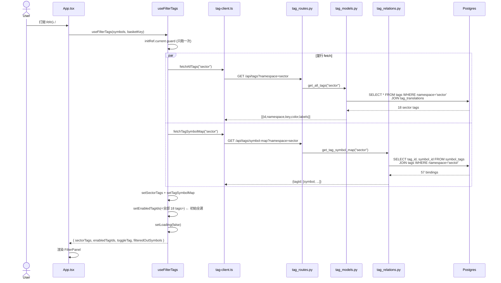
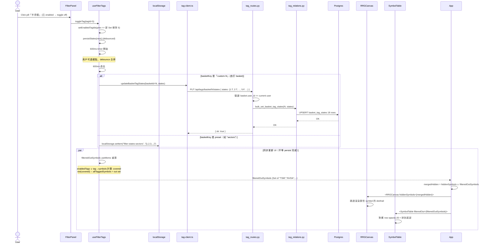
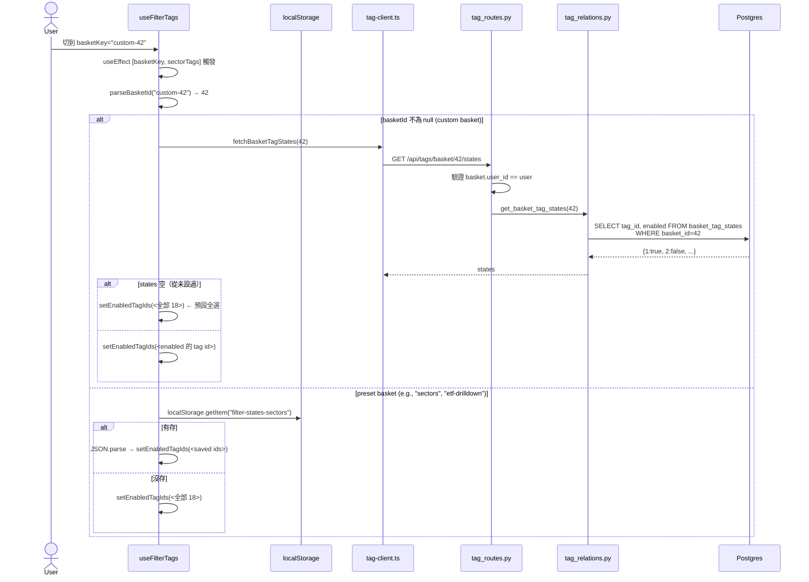

# Sequence 03 — Filter + Tag Flow

> **Type**: Sequence diagram (L3, 子目錄重置編號)
> **Layer**: lockstep
> **Last verified**: 2026-05-24 against `feat/viewport-am-fix`

## User Story

User 看 RRG 主畫面 → 右上角 FilterPanel 顯示 sector pill（科技 / 半導體 / 量子 / ...）→ 點「半導體」**toggle off** → RRG canvas 上半導體股票淡出消失，table 灰化排底 → 切到另一個 basket，filter 狀態 **記住**（preset 用 localStorage，自訂 basket 用 API）→ 回來，狀態恢復。

**3 個 entry**：
1. **Initial load**（fetch tags + tag-symbol map）
2. **Toggle tag**（改 enabled set → debounce 600ms → persist）
3. **Basket switch**（load 該 basket 的 filter states，dual-storage）

涵蓋 backend **8 個 tag endpoint** + **9 張 DB 表中的 4 張** (tags / tag_translations / symbol_tags / basket_tag_states)。

---

## Sequence Diagrams

### 3.1 Initial Load（mount）



### 3.2 Toggle Tag（用戶點 sector pill）



### 3.3 Basket Switch（dual-storage load）



---

## 涉及檔案

### Frontend

| 檔案 | 行 | 角色 |
|------|-----|------|
| [hooks/useFilterTags.ts](../../../frontend/src/hooks/useFilterTags.ts) | (136) | **dual-storage 核心** — load + toggle + debounce + persist + filteredOut compute |
| [api/tag-client.ts](../../../frontend/src/api/tag-client.ts) | (94) | 7 個 fetch wrapper（**重複 authHeaders** → R11）|
| [components/FilterPanel.tsx](../../../frontend/src/components/FilterPanel.tsx) | - | UI: pill 列表 + toggle + reset 按鈕 |
| [components/FilterPill.tsx](../../../frontend/src/components/FilterPill.tsx) | - | 單個 pill 視覺 |
| [App.tsx:52-58](../../../frontend/src/App.tsx#L52-L58) | 52-58 | `mergedHidden = hiddenSymbols ∪ filteredOutSymbols` 合併兩種 hidden |

### Backend

| 檔案 | 行 | 角色 |
|------|-----|------|
| [server/tag_routes.py](../../../server/tag_routes.py) | (112) | 8 個 endpoint（list/create/symbol-map/symbol get-add-del/basket-states get-put）|
| [server/tag_models.py](../../../server/tag_models.py) | (?) | Tag dataclass + create_tag / get_all_tags / get_tag_by_id |
| [server/tag_relations.py](../../../server/tag_relations.py) | (?) | symbol_tags / basket_tag_states CRUD + get_tag_symbol_map |
| [server/tag_schemas.py](../../../server/tag_schemas.py) | - | Pydantic: CreateTagRequest / SymbolTagRequest / BasketTagStateRequest / TagResponse |
| [server/seed_tags.py](../../../server/seed_tags.py) | (197) | 16 color + 18 sector + signal tags seed (R9 候選) |

### DB Tables（涉及 4 張）

| 表 | 角色 |
|----|------|
| `tags` | id, namespace (sector/color/cap/signal/custom), key, color, type, created_by |
| `tag_translations` | tag_id, locale, label (zh-TW / en) |
| `symbol_tags` | symbol_id, tag_id, user_id (system tags 用 user_id=1) |
| `basket_tag_states` | basket_id, tag_id, enabled (custom basket 的 filter 狀態) |

---

## 關鍵概念補底

### Dual-Storage Pattern

```typescript
// useFilterTags.ts L57-81 — load 兩條路
useEffect(() => {
  const basketId = parseBasketId(basketKey);
  if (basketId) {
    fetchBasketTagStates(basketId).then(...)  // ← custom: API
  } else {
    localStorage.getItem(`${LS_PREFIX}${basketKey}`)  // ← preset: LS
  }
}, [basketKey, sectorTags]);

// L83-97 — persist 兩條路
const persistStates = useCallback((enabled) => {
  saveTimer.current = setTimeout(() => {
    if (basketId) updateBasketTagStates(...)
    else localStorage.setItem(...)
  }, DEBOUNCE_MS);  // 600ms debounce
}, []);
```

**為什麼 dual-storage**：
- Preset basket 是「shared schema」（所有 user 同樣的「Sectors」），不該 push 到 DB（污染他人 / 沒對應 row）
- Custom basket 才有 `baskets.id` row 可以掛 `basket_tag_states`
- LS 速度快、不要 round-trip API

**trade-off**：邏輯散兩處，改 schema 要同步改兩邊。

**Unity 比喻**：類似 PlayerPrefs（local）vs SaveSlot（cloud）混用。

### Debounce Pattern with Ref

```typescript
// L39, 86-87
const saveTimer = useRef<ReturnType<typeof setTimeout>>();
// ...
if (saveTimer.current) clearTimeout(saveTimer.current);
saveTimer.current = setTimeout(() => { ... }, DEBOUNCE_MS);
```

**為什麼用 ref**：
- `useState` 變 timer ID 會觸發 re-render（多餘）
- `useRef` 持有 mutable value 不 trigger render
- 用戶連點 5 次 → 只有最後一次的 setTimeout 留下，前 4 個 clearTimeout 掉

**Unity 比喻**：等同存一個 `Coroutine` reference，新呼叫 stop old + start new。

### Ref 同步 Props

```typescript
// L40-41
const basketKeyRef = useRef(basketKey);
basketKeyRef.current = basketKey;  // 每 render 同步
```

**為什麼**：`persistStates` 在 `setTimeout` 內讀 basketKey，但 callback 內如果直接抓 props 會抓到 stale 值（closure 抓 mount 時的）。用 ref 確保抓到當下值。

**這是 React anti-pattern 警告燈**：通常意味著 effect / callback dependency 沒設好。**正解**是把 `basketKey` 加進 callback dep（但會讓 callback 每次重建，與 saveTimer 衝突）。**candidate R-issue**。

### filteredOutSymbols 計算邏輯

```typescript
// L114-132 — useMemo 重算
const out = new Set<string>();
const covered = new Set<string>();  // 被任一 enabled tag 涵蓋的 symbols
for (const tagId of enabledTagIds) {
  tagSymbolMap[tagId]?.forEach((s) => covered.add(s));
}
const allTaggedSymbols = ... // 全部有 tag 的 symbols
for (const sym of symbols) {
  if (allTaggedSymbols.has(sym) && !covered.has(sym)) out.add(sym);  // 有 tag 但沒在 enabled 內 → 過濾掉
}
```

**邏輯**：「無 tag 的 symbol 不過濾」（給 untagged symbol 自由通過）。所以 filter 只影響「我有標 sector 的股票」。

---

## 邊界 / 已知議題

### 已在 backlog
- **R11 authHeaders DRY** — tag-client.ts L9 又一個 authHeaders 重複實作
- **R9 seed_tags 改 migration** — 18 sector + 16 color seed 是執行檔不是 migration
- **R10 半完成 audit** — Tag CRUD UI 還沒有，只有 filter UI

### 本 sequence 新發現

- **候選 R29 — `next.has(tagId) ? next.delete(tagId) : next.add(tagId)` ternary side-effect**：[useFilterTags.ts:102](../../../frontend/src/hooks/useFilterTags.ts#L102)。又一個 anti-pattern（之前 App.tsx toggleSymbol 也犯）。應該用 if/else。**全 codebase 該 grep audit**。

- **候選 R30 — basketKeyRef 同步 props anti-pattern**：[L40-41](../../../frontend/src/hooks/useFilterTags.ts#L40-L41) 用 ref 補 callback closure 抓 stale prop。**正解**是調整 dep 結構，或用 `useEffectEvent` (React 19 RFC)。

- **候選 R31 — preset basket key 沒驗證**：[L71](../../../frontend/src/hooks/useFilterTags.ts#L71) 直接用 `basketKey` 當 LS key。若 key 帶特殊字元（未來 user 自訂 preset name）會踩 LS quirks。應該 normalize。

- **候選 R32 — 「states 空就預設全選」邏輯 fragile**：[L62](../../../frontend/src/hooks/useFilterTags.ts#L62) `Object.keys(states).length === 0` 來判斷「沒設過」。如果未來 backend 改成「沒設過時回傳 nulls」會壞。應該 explicit 用 HTTP 404 或 schema field。

- **候選 R33 — filteredOutSymbols 計算每次重跑全部 symbols**：[L114-132](../../../frontend/src/hooks/useFilterTags.ts#L114-L132) useMemo 在 enabled / symbols / map 任一變動就重算 O(N×M)。1000 symbols + 18 tags 可能撐得住但要監控。

---

## 修法優先序

| 議題 | R# | Tier | 何時 |
|------|----|------|------|
| authHeaders DRY | R11 | P0 | M1 |
| seed_tags migration | R9 | P1 | M1 |
| ternary side-effect audit | R29 (new) | P2 | M2 |
| basketKeyRef anti-pattern | R30 (new) | P2 | M2 |
| LS key normalize | R31 (new) | P3 | 等踩到 |
| states empty 判斷 | R32 (new) | P3 | 等踩到 |
| filteredOut perf | R33 (new) | P3 | 1000 symbol scale 時驗 |

---

## Cross-references

- [01-login-flow](01-login-flow.md) — 前置（user / dev login）
- [02-rrg-main-flow](02-rrg-main-flow.md) — RRG canvas 收到 hiddenSymbols 後渲染
- [31-refactor-backlog](../31-refactor-backlog.md) — R9/R11/R29/R30/R31/R32/R33
- 後續 sequence:
  - 04 Basket Create + 4 entries
