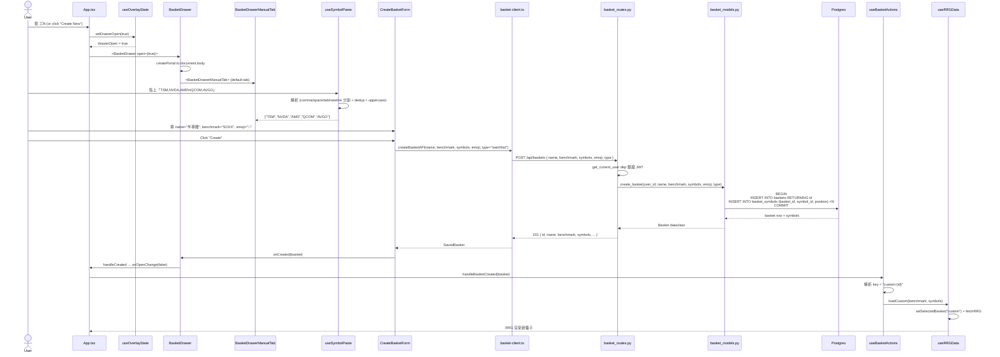
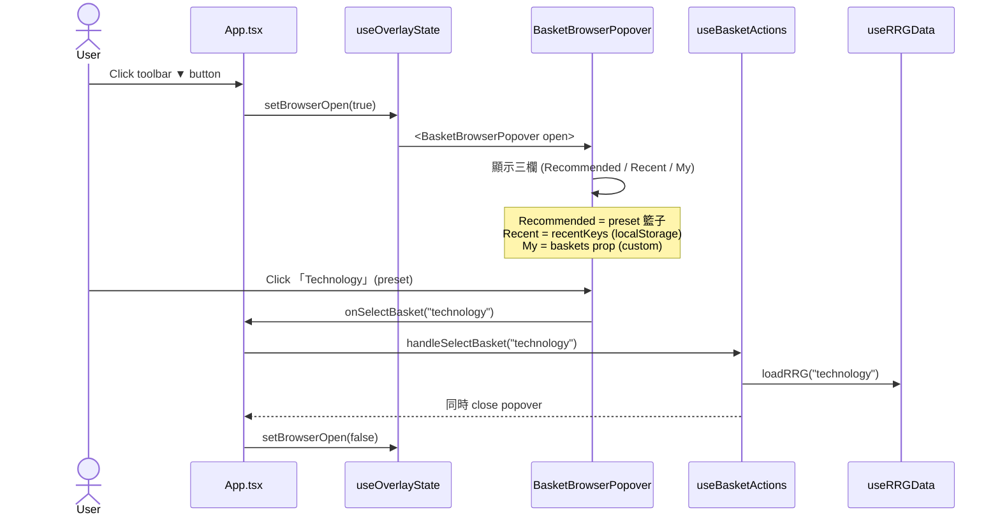
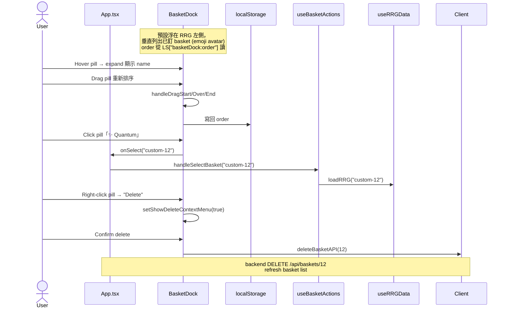
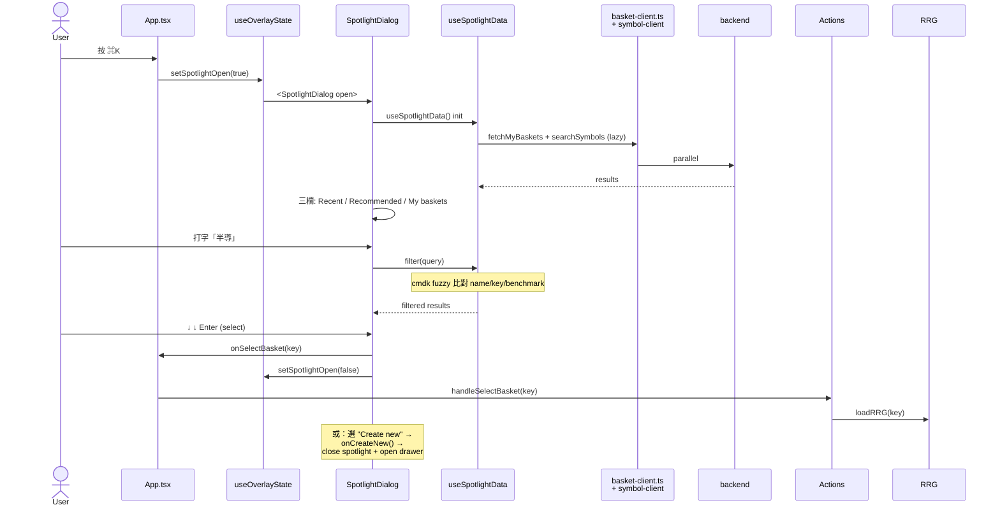

# Sequence 04 — Basket Create + 4 Entry Comparison

> **Type**: Sequence diagram (L3, 子目錄重置編號)
> **Layer**: lockstep
> **Last verified**: 2026-05-24 against `feat/viewport-am-fix`

## User Story

User 想新增 / 切換 / 搜尋 basket，有 **4 個入口** 並存（同時掛在 App.tsx），各自針對不同情境：

| 入口 | 觸發 | 主動作 |
|------|------|--------|
| **BasketDrawer** | ⌘N or 「Create New」按鈕 | **建立**（手動 / AI 截圖 / 匯入 3 個 tab） |
| **BasketBrowserPopover** | toolbar ▼ button | **瀏覽 + 選** 三欄（Recommended / Recent / My） |
| **BasketDock** | 預設浮在左邊 | **快切**已釘 basket（drag reorder + emoji） |
| **SpotlightDialog** | ⌘K | **搜尋** baskets + symbols + filter syntax |

4 個入口都最終呼叫 `handleSelectBasket` 或 `loadCustom` / `handleBasketCreated` —— **單一 dispatch point**。

---

## Sequence Diagrams

### 4.1 Create Basket via Drawer (Manual Tab)



### 4.2 Browse via BasketBrowserPopover



### 4.3 Quick Switch via BasketDock



### 4.4 Spotlight ⌘K Search



---

## 涉及檔案

### Frontend

| 檔案 | 行 | 角色 |
|------|-----|------|
| [App.tsx:178-188](../../../frontend/src/App.tsx#L178-L188) | 178-188 | **4 個 overlay 同時掛載**（Spotlight / Browser / Drawer / SettingsSheet）|
| [hooks/useOverlayState.ts](../../../frontend/src/hooks/useOverlayState.ts) | - | spotlightOpen / browserOpen / drawerOpen / settingsOpen 四個 state + ⌘K ⌘N shortcut |
| [hooks/useBasketActions.ts](../../../frontend/src/hooks/useBasketActions.ts) | - | **單一 dispatch** — handleSelectBasket / handleBasketCreated |
| [hooks/useBaskets.ts](../../../frontend/src/hooks/useBaskets.ts) | - | BasketsProvider Context + guest mode (LS fallback) |
| [hooks/useSymbolPaste.ts](../../../frontend/src/hooks/useSymbolPaste.ts) | - | 解析貼上的 ticker (comma/space/tab/newline) + dedup + uppercase |
| [api/basket-client.ts](../../../frontend/src/api/basket-client.ts) | (87) | CRUD + searchSymbols + ETF holdings（R11 又一個 headers()）|
| [components/BasketDrawer.tsx](../../../frontend/src/components/BasketDrawer.tsx) | (107) | createPortal + 3 tab + confirm discard |
| [components/BasketDrawerManualTab.tsx](../../../frontend/src/components/BasketDrawerManualTab.tsx) | - | Symbol paste + form |
| [components/BasketDrawerAITab.tsx](../../../frontend/src/components/BasketDrawerAITab.tsx) | - | PAL MCP Grok 持倉截圖解析 → JSON |
| [components/BasketDrawerPlaceholderTab.tsx](../../../frontend/src/components/BasketDrawerPlaceholderTab.tsx) | - | Import tab (未實作) |
| [components/CreateBasketForm.tsx](../../../frontend/src/components/CreateBasketForm.tsx) | - | name/benchmark/emoji input + Create button |
| [components/BasketBrowserPopover.tsx](../../../frontend/src/components/BasketBrowserPopover.tsx) | - | toolbar ▼ → 三欄 popover |
| [components/BasketDock.tsx](../../../frontend/src/components/BasketDock.tsx) | (12 fn) | 浮動 left dock + drag reorder + right-click context |
| [components/SpotlightDialog.tsx](../../../frontend/src/components/SpotlightDialog.tsx) | - | ⌘K cmdk + 三欄 list |

### Backend

| 檔案 | 行 | 角色 |
|------|-----|------|
| [server/basket_routes.py](../../../server/basket_routes.py) | (69) | 4 個 endpoint（list/create/update/delete）|
| [server/basket_models.py](../../../server/basket_models.py) | (?) | create/update/delete + get_user_baskets + _basket_from_row |
| [server/basket_schemas.py](../../../server/basket_schemas.py) | - | Pydantic: CreateBasketRequest / UpdateBasketRequest / BasketResponse |

### DB Tables

| 表 | 角色 |
|----|------|
| `baskets` | id, user_id, name, emoji, type (watchlist/portfolio), benchmark |
| `basket_symbols` | basket_id, symbol_id, position (有序), weight (M2 用) |

---

## 關鍵概念補底

### Portal Pattern (React)

```typescript
// BasketDrawer.tsx L41-105
return createPortal(
  <div className="fixed inset-0 z-50">
    {/* drawer + backdrop */}
  </div>,
  document.body,  // ← 渲染在 root 外
);
```

**為什麼用 portal**：
- DOM 上掛在 `document.body` 之外（z-index 不受父層 stacking context 影響）
- comment 寫「shadcn Sheet specificity issues」← 用 portal 解決 Tailwind specificity / shadcn variant 衝突
- 缺點：失去 React event bubbling 語義（要小心 outside click）

**Unity 比喻**：類似 Unity 的 Canvas Sort Order — 把 UI 強制畫在最上層。

### Confirm-Discard Pattern

```typescript
// BasketDrawer L29-37, 82-101
const [confirmClose, setConfirmClose] = useState(false);
const tryClose = () => setConfirmClose(true);  // ← 不直接關
const close = () => { setConfirmClose(false); onOpenChange(false); };
// 渲染 confirm dialog 蓋在 drawer 上
```

**為什麼**：drawer 內有未儲存的 form 內容 + AI chat history，直接關會丟資料。

**hardcoded dialog**：沒用 shadcn AlertDialog 而是手刻 → 候選 R-issue。

### 4 個 Overlay 共生策略

```typescript
// App.tsx L178-192 — 4 個 overlay 同時掛載
<SpotlightDialog open={overlays.spotlightOpen} ... />
<BasketBrowserPopover open={overlays.browserOpen} ... />
<BasketDrawer open={overlays.drawerOpen} ... />
<SettingsSheet open={overlays.settingsOpen} ... />
// + ChartModal
```

**為什麼共生**：
- 各自獨立 z-index，user 可同時開（雖然 UX 上通常一次一個）
- useOverlayState 管 4 個 boolean，可以同時 true（沒互斥邏輯）
- **缺點**：4 個各自管理 state，相關邏輯散在 useOverlayState

**modal stack 替代方案**：用 single「currentModal」discriminated union 強制互斥（R-候選）。

### Spotlight ↔ Drawer 聯動

```typescript
// BasketBrowserPopover / Spotlight 內：
onCreateNew={() => {
  overlays.setBrowserOpen(false);   // 關自己
  overlays.setDrawerOpen(true);     // 開 drawer
}}
```

**Pattern**：「上層入口」(Spotlight / Popover) 開啟「下層動作」(Drawer)。需要先關上層避免疊兩個 modal。

---

## 邊界 / 已知議題

### 已在 backlog
- **R11 authHeaders / headers DRY** — basket-client.ts L7 又一個自己定義的 `headers()`，跟 tag-client / note-client 重複（**且命名不一致**：basket 叫 `headers`，其他叫 `authHeaders`）
- **R13 過細評估** — BasketDrawer 3 個 Tab 各一個檔（Manual / AI / Placeholder），對應 R14 folder 分層
- **R14 frontend folder** — Basket 系列 9 個 component 都平鋪

### 本 sequence 新發現

- **候選 R34 — `BasketDrawer` 用 createPortal 取代 shadcn Sheet**：[BasketDrawer.tsx:4](../../../frontend/src/components/BasketDrawer.tsx#L4) comment「specificity issues」。應該**root cause** shadcn Sheet specificity，或文件化原因 + 規範後續用法（其他 drawer 該繼續用 portal 還是 shadcn Sheet？）。

- **候選 R35 — Confirm-Discard dialog 手刻而非 shadcn AlertDialog**：[BasketDrawer.tsx:82-101](../../../frontend/src/components/BasketDrawer.tsx#L82-L101)。風險：未來 dialog 樣式不一致 + a11y / focus trap 自己實作可能漏。

- **候選 R36 — 4 個 overlay 沒互斥邏輯**：useOverlayState 4 個 boolean 可以同時 true。Modal stack 該用 discriminated union 或 single state 強制互斥。

- **候選 R37 — `basket-client.ts:7` headers() 命名不一致**：tag-client.ts / note-client.ts 叫 `authHeaders()`，basket-client.ts 叫 `headers()`。修 R11 時順手統一。

- **候選 R38 — `BasketDrawer` confirmClose 永遠 trigger**：即使 user 還沒填任何東西也會 confirm。應該偵測 dirty state，沒改動就直接關。

- **候選 R39 — Spotlight 內邏輯重複**：BasketBrowserPopover 和 Spotlight 都是「三欄 Recent/Recommended/My」+「Create new」。應該抽 `<BasketChooser>` 共用組件。

---

## 修法優先序

| 議題 | R# | Tier | 何時 |
|------|----|------|------|
| authHeaders/headers DRY | R11 | P0 | M1 |
| BasketDrawer portal vs Sheet root cause | R34 (new) | P2 | M2 |
| Confirm dialog 用 shadcn AlertDialog | R35 (new) | P2 | M2 |
| 4 overlay 互斥 modal stack | R36 (new) | P2 | M2 |
| headers() 命名統一 | R37 (new) | P0 | 跟 R11 一起 |
| Confirm 偵測 dirty | R38 (new) | P3 | 等抱怨 |
| Spotlight ↔ Browser 抽共用 | R39 (new) | P2 | M2 |

---

## Cross-references

- [01-login-flow](01-login-flow.md) — 前置（user must be authenticated）
- [02-rrg-main-flow](02-rrg-main-flow.md) — handleSelectBasket → useRRGData.loadRRG
- [03-filter-tag-flow](03-filter-tag-flow.md) — basket switch → useFilterTags 重 load states
- [31-refactor-backlog](../31-refactor-backlog.md) — R11/R13/R14/R34-R39
